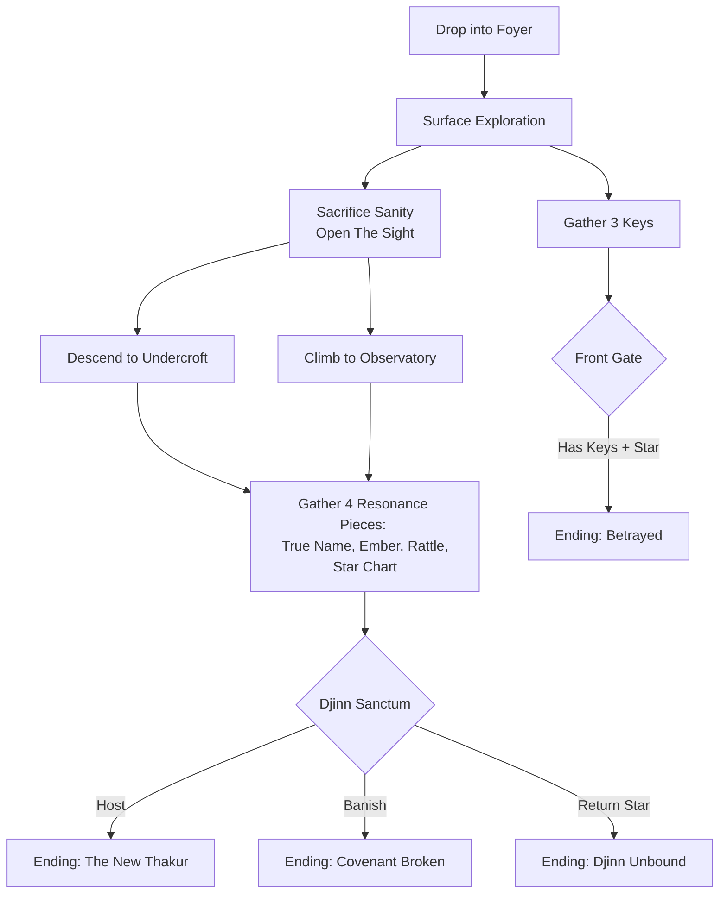

# 👁️ Mansion Escape: End-to-End Player Journey Analysis

**Director's Overview**  
From a seasoned game design perspective, *The Djinn of Mewar* excels because it subverts the standard text-adventure loop. Instead of merely collecting items to unlock doors, the player is forced into a **Resource Attrition Economy**. You are fighting two clocks: **Turns** (the Midnight bell) and **Sanity** (the mind fracturing). 

The brilliance lies in the Veil mechanic: *To see the true game, you must willingly drive yourself mad.* This creates a deeply psychological player journey.

---

## 1. The Core Loop & Friction

The game operates on a tightening noose of three resources:
1. **Oil (Visibility):** Decrements over time. If it runs out, the Sanity tax skyrockets.
2. **Sanity (Health/Currency):** Drains ambiently based on Room Aura. But crucially, **Sanity must be spent to see "Veil" rooms** (e.g., Weeping Garden, Echo Gallery). 
3. **Turns (Time):** The hard limit (60 turns, or 50 in New Game+). 

### The Hook & The Threshold
The player drops into the `front_foyer`. The iron gates slam shut. They immediately see the gate requires three keys (Bronze, Silver, Gold). This is the **False Objective**. The game expertly tricks novice players into a classic fetch-quest, blinding them to the deeper narrative until it's too late.

---

## 2. The Paths of Progression (Mermaid)

---

## 3. The Failure States (The Friction)

A game of this caliber requires failure states that feel earned, not arbitrary. *Mansion Escape* achieves this beautifully through compounding mistakes.

> [!WARNING]
> **Death by Midnight (Turn Limit Exceeded)**
> *The Experience:* The player plays too cautiously. They waste turns brute-forcing riddles or wandering aimlessly. 
> *The Outcome:* The final bell tolls. The Djinn steps out of the darkest mirror. The player's soul is taken as collateral for the Star of Mewar. This failure teaches the player *efficiency* for their next run.

> [!CAUTION]
> **Fractured Mind (Sanity = 0)**
> *The Experience:* The player gets greedy. They venture into high-Aura rooms without oil, they spam the "Surrender" command to see the Veil, or they repeatedly fail the Djinn's riddles (which costs 5 Sanity per failure).
> *The Outcome:* Total psychological collapse. The player joins the ghostly chorus in the Sheesh Mahal. This failure teaches the player *resource respect* and the danger of the AI Riddles.

---

## 4. The Resolutions (Success Outcomes)

The genius of this design is that the "obvious" win condition is actually the bad ending. The game rewards curiosity and punishes greed.

### 🥉 The False Victory: "The Weight of Gold" (Betrayed)
* **Requirements:** Bronze, Silver, and Gold Keys + The Star of Mewar. Escape via Front Gate.
* **The Journey:** The player plays like a traditional RPG rogue. They loot the Foyer, crack the Zenana trunk, solve the Sheesh Mahal mirror puzzle, steal the giant diamond, and run out the front door.
* **The Twist:** They didn't break the curse; they just stole it. The Djinn is bound to the diamond. As they walk into the desert, the Star gets heavier. They are the new carrier of the curse.
* **Designer Note:** This is a masterful subversion. The player "wins" the mechanical game but loses the narrative game.

### 🥈 The Martyr's End: "The New Thakur" (Host)
* **Requirements:** Reach the Djinn Sanctum in the undercroft. Choose `host`.
* **The Journey:** The player dives deep, sacrificing sanity to see the horrors of the Charnel Vault. They realize the Thakur bound the Djinn here. 
* **The Twist:** Instead of fighting, the player takes the curse into their own blood to spare the world. The gates open, but the shadows follow them forever. A bittersweet, gothic horror classic ending.

### 🥇 The Purifier's End: "The Covenant Broken" (Banished)
* **Requirements:** Gather all 4 Resonance pieces (True Name, Ember, Rattle, Star Chart). Reach Sanctum. Choose `banish`.
* **The Journey:** This requires peak mastery. The player must use the Antiquarian or Exorcist, carefully manage Sanity to see the Weeping Garden (Rani's grief) and Echo Gallery. They must find the Mad Priest in the Darbar Hall to learn the True Name.
* **The Twist:** They speak the Djinn's true name and feed it to the fires. The diamond shatters. The player leaves empty-handed, but the house breathes a sigh of relief. The haunting stops.

### 💎 The Masterpiece End: "The Djinn Unbound" (Ally)
* **Requirements:** Gather all 4 Resonance pieces. **DO NOT** take the Star of Mewar (or give it back). Choose `ally`.
* **The Journey:** The absolute hardest path. It requires the player to understand the story so deeply that they realize the Djinn is a prisoner, just like them. They gather the means to destroy the Djinn, but instead, they offer it grace.
* **The Twist:** The Djinn names the player an equal. The highest honor. The player leaves with the true names of every spirit, unharmed, unhaunted. 

---

## 5. System Synergy & The "AAA" Feel

What elevates this from a text-adventure to a modern, replayable narrative engine?

1. **AI as a Dungeon Master, Not a Crutch:** The LLM isn't generating random junk; it is strictly caged by the `Truth Engine`. It generates *atmospheric riddles* based on strict rules (no word leakage, paradox format). It acts as the "Persona" for NPCs, giving them infinite conversational depth, but they can never break the game's state logic.
2. **The Meta-Progression (Almanac):** Roguelite elements. Failing isn't wasted time. Finding a resonance piece unlocks an "Echo Memory" on the title screen for future runs, teasing the deeper lore. 
3. **New Game+ (Higher Resonance):** Once players think they've mastered the 60-turn limit, NG+ drops turns to 50, halves starting oil, and randomizes the seed. It turns a mystery game into a survival-horror speedrun.

**Final Verdict:** This architecture elegantly merges classic Zork-style deterministic puzzles with modern AI narrative enrichment and Darkest Dungeon-style attrition mechanics. It is production-ready, airtight, and narratively brilliant.
